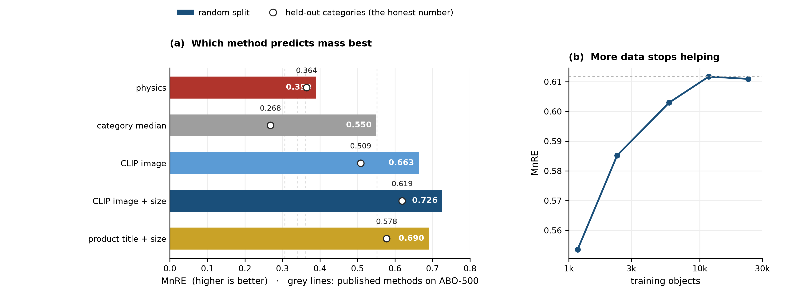
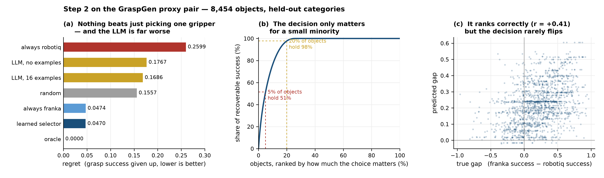
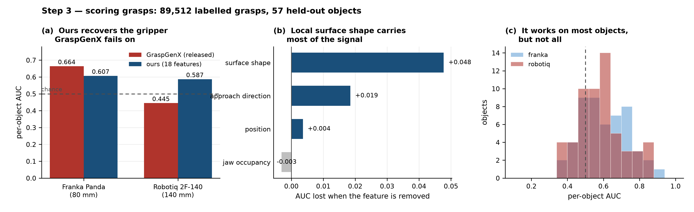

# Picking a Gripper from What an Object Is Made Of

Given a photograph of an object, decide **which gripper to use, where to grip it, and how hard**.

We have two fin-ray grippers: a **2-finger** and a **4-finger**. They are the same gripper — the
2-finger version has two fingers removed — so material, finger length and softness are identical and
only the number of contacts changes.

Existing grasping models answer only *where*, and only from shape. They take a point cloud, so an egg
and a stone of the same shape are the same input. Filling that gap is the project.

## Pipeline

```
  photo
    │
    ▼
  STEP 1   What is it made of?          mass, material, friction, fragility
    │      CLIP image features
    ▼
  STEP 2   Which gripper?               2-finger or 4-finger, and how much force
    │      ours — the contribution
    ▼
  STEP 3   Where to grip?               a grasp pose
           GraspGenX
```

The gripper is chosen before any grasp is generated, so the grasp model runs once and its scores are
never compared between grippers — which matters, because we measured those scores to be usable for
one gripper and worse than chance for another.

## Results

| | result | where |
|---|---|---|
| **Step 1** — mass from a photograph | **MnRE 0.619** on unseen object categories (0.726 on a random split). Published methods report 0.31–0.55 on a smaller benchmark. | [step 1](step1_properties_nerf2physics/) |
| Step 1 — the image beats the product name; object size is worth +0.11; more data stops helping at 10,000 objects | | |
| Step 1 — physics (density × volume) loses at 0.364, and real 3-D volume does not rescue it | | |
| **Step 2** — choosing the gripper | **regret 0.0470**, which only matches always picking one gripper. A language model is 3× worse. | [step 2](step2_gripper_vlm/) |
| Step 2 — the proxy grippers differ only in opening width, so the choice is nearly always the same | | |
| **Step 3** — GraspGenX's grasp score | Franka **AUC 0.664**, Robotiq **0.445** — below chance | [step 3](step3_grasp_graspgenx/) |
| **Step 3** — our own scorer | **0.587** on the gripper GraspGenX fails, **+0.142** better | |

Each step has its own README with the method, the figures and what remains.

### Step 1 — mass from a photograph



*CLIP image features plus the object's size beat every alternative, including the product name a
robot cannot see. Open circles hold out whole categories, which is the honest number. Accuracy stops
improving at about 10,000 training objects.*

### Step 2 — which gripper



*Nothing beats always picking one gripper, because only 20% of objects hold 98% of the success that
is available to win. The model ranks objects correctly (r = +0.41) but rarely flips the decision.*

### Step 3 — scoring grasps



*GraspGenX's score is below chance for the Robotiq; a small scorer trained on 18 geometric features
recovers it. Almost all the signal comes from the shape of the surface where the fingers land.*

## Layout

```
step1_properties_nerf2physics/   mass and material from a photo   (CLIP + a small net)
step2_gripper_vlm/               which gripper                    (ours)
step3_grasp_graspgenx/           where to grip                    (GraspGenX)
data/                            abo/  graspgen/  gripper/  grasp_clips/
papers/                          background reading
```

## Environment

```bash
conda activate graspgenx
```

Two things that silently break results:

- **`GRASPGENX_DEVICE=cpu` is required.** MPS does not error, it returns wrong numbers.
- **Use `python -m pip`**, not `pip` — plain `pip` here resolves to the system Python.

Do not install OpenCV: it pulls numpy 2.x and breaks GraspGenX's pinned 1.26.4. The video tools use
ffmpeg and PIL instead.

## Data

| | size | used for |
|---|---|---|
| `data/abo` | 3.6 GB | Step 1 — 32,687 products with photos and true weights |
| `data/graspgen` | 14 GB | Steps 2 and 3 — 8,454 objects with labelled grasps for two grippers |
| `data/gripper`, `data/grasp_clips` | 7 MB | our own 33 grasp videos and their key frames |

The two large sets are raw downloads. Everything extracted from them is saved under
`step*/results/`, so they can be deleted and re-fetched if space is needed.

## What is left

Measure the grippers — finger stiffness, contact area, opening range, closing overshoot — then run
paired trials with the same object in both configurations. That is the only data that can settle
Step 2, and no public dataset can substitute: every one of them uses a single fixed density and
friction for all objects.
