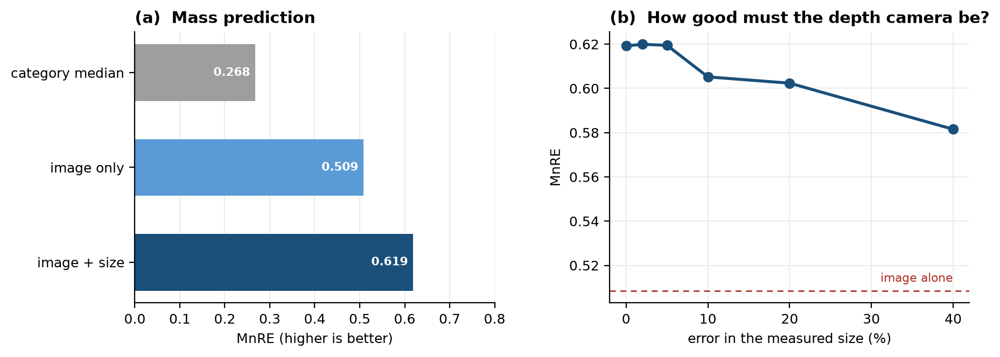
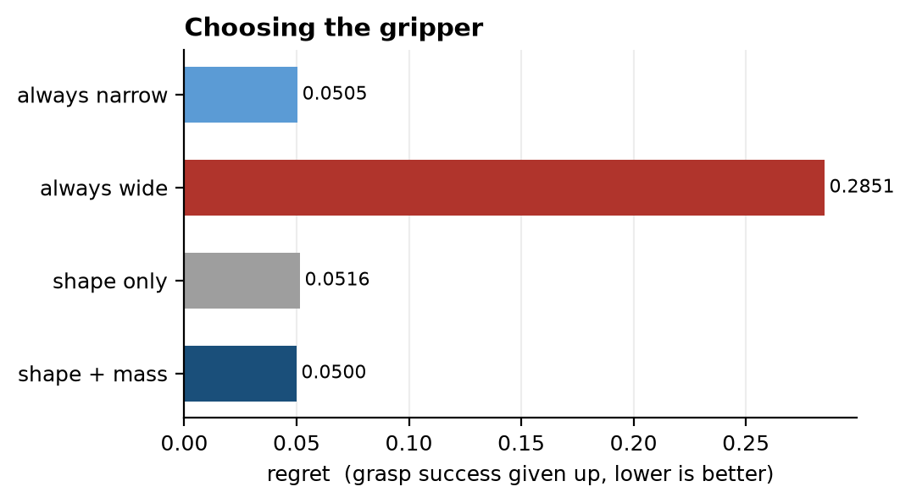
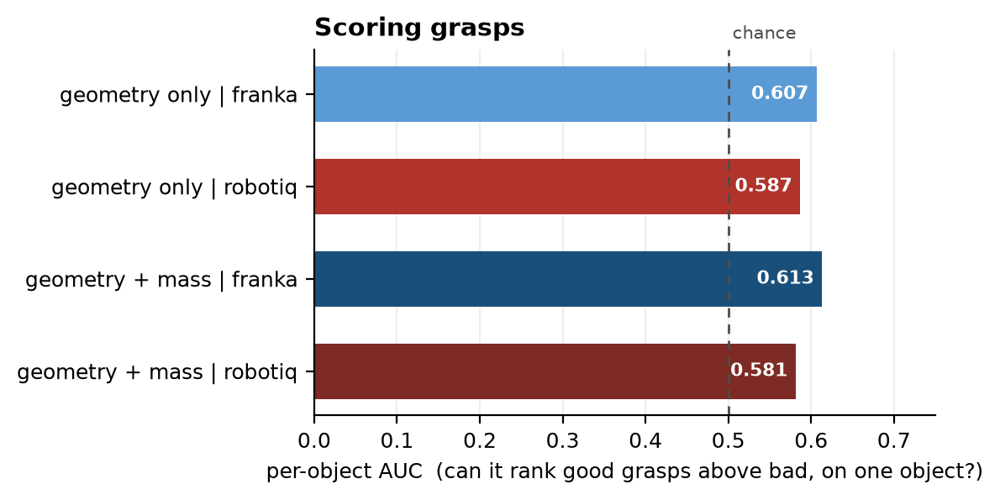
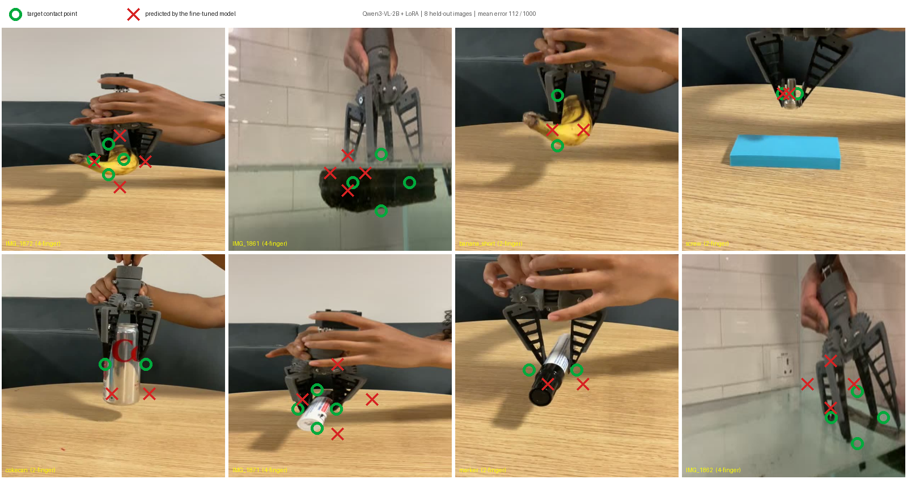

# Picking a Gripper from What an Object Is Made Of

Given a photograph of an object, decide **which gripper to use, where to grip it, and how hard**.

Two fin-ray grippers: a **2-finger** and a **4-finger**. They are the same gripper — the 2-finger has
two fingers removed — so material, finger length and stiffness are identical and only the number of
contacts changes.

## Pipeline

```
  photo + depth
       │
       ▼
  STAGE 1   object → size → mass                      MnRE 0.619
       │
       ▼
  STAGE 2   object + mass → which gripper             regret 0.0500
       │
       ▼
  STAGE 3   object + mass + gripper → grasp points    AUC 0.607
```

## Results

### Stage 1 — mass from a photograph

**MnRE 0.619** with size, 0.509 without. A 40% error in the measured size still beats using no size at
all, so a cheap depth sensor suffices.



*Left: image + size beats every alternative, including the product name a robot cannot see. Right:
accuracy stops improving at about 10,000 training objects.*

### Stage 2 — which gripper

**Regret 0.0500**, which only matches always picking one gripper (0.0505). Adding mass changes nothing.



*Nothing beats the trivial baseline, because the oracle can only recover 4.8 points in the first place.*

### Stage 3 — where to grip

Analytic proposals land **2–9 mm** from the object surface. The scorer reaches **AUC 0.607**, and the
4-finger is correctly found infeasible on objects too big for its 148 mm envelope.



*Mass shifts the scorer by ±0.006 — nothing, for the same reason as Stage 2.*

### A vision-language model, fine-tuned on the Mac

**Qwen3-VL-2B + LoRA**, run entirely on the M4 — 8.7 M trainable parameters, peak **10.5 GB of 16 GB**,
about 6 minutes per stage. No GPU, no cloud.

| | zero-shot | fine-tuned | baseline |
|---|---|---|---|
| **stage 2** — which gripper | 61% | 75% | 75% (majority) |
| **stage 3** — grasp points | 75% format, 192 err | **100% format, 112 err** | — |



*Eight held-out images. Green circles are the target contact points, red crosses the model's
predictions. Fine-tuning fixed the output format completely and cut point error by 42%.*

Stage 2 only reaches the majority baseline: 23 training examples split 19/4 teach the class prior, not
the distinction. **Stage 3 genuinely improves**, because the task has geometric structure to learn
rather than a lopsided class split to memorise.

## The honest limitation

**Mass does not help Stages 2 or 3 — but that cannot be tested on public data.** Every public grasping
dataset uses *one fixed density and friction for all objects*. GraspGen and MultiGripperGrasp both do.
So the labels contain no mass information, and the core claim of this pipeline is untestable on them
by construction.

**Only our own trials can settle it.** We have 33 grasp clips and **3 objects tried in both gripper
configurations**. More paired trials is the single most valuable thing to collect.

## Layout

```
stage1_mass/       stage1_mass.ipynb       photo + depth → mass
stage2_gripper/    stage2_gripper.ipynb    → which gripper
stage3_grasp/      stage3_grasp.ipynb      → grasp points
data/              abo/ graspgen/ gripper/ grasp_clips/
gripper/           our gripper's STL files
papers/            background reading
```

## Environment

```bash
conda activate graspgenx
jupyter notebook
```

Do not install OpenCV — it pulls numpy 2.x and breaks the pinned 1.26.4. The video tools use ffmpeg
and PIL instead.

## Data

| | size | used by |
|---|---|---|
| `data/abo` | 3.6 GB | Stage 1 — 32,687 products with photos and true weights |
| `data/graspgen` | 14 GB | Stages 2 and 3 — 8,454 objects with labelled grasps |
| `data/gripper`, `data/grasp_clips` | 7 MB | our 33 grasp videos and their key frames |

Both large sets are raw downloads; everything extracted from them is saved in `stage*/results/`, so
they can be deleted and re-fetched if space is needed.
