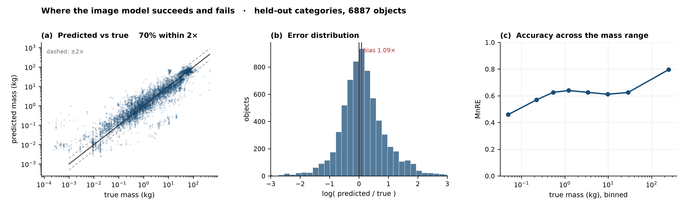
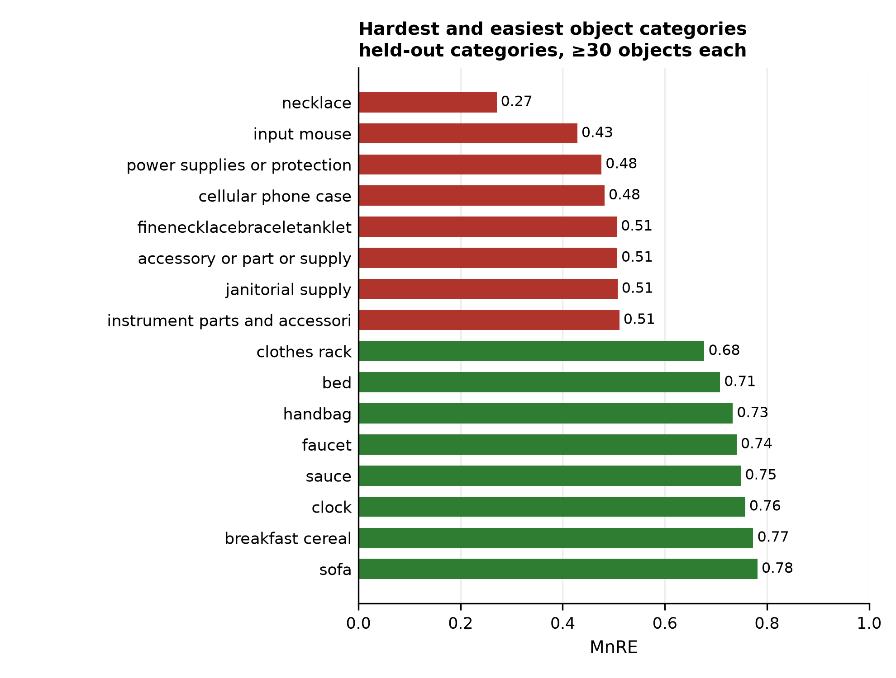

# Step 1 — What is the object made of?

Given a photograph of an object, predict its **mass**.

## Our pipeline

```
  photo of the object
        │
        ▼
  CLIP ViT-B/32          turns the photo into 512 numbers
        │
        │  + 5 numbers describing size:
        │    volume, height, width, length, how elongated it is
        ▼
  small neural net       517 → 256 → 128 → 1
        │
        ▼
  mass, in kilograms
```

**Why an image and not a product name.** A robot's camera gives a picture, not an Amazon listing
title. We trained a title-based model too, and the image model beats it, so nothing is lost.

**Why the size numbers.** They are the single most useful addition — worth +0.11 — and our depth
camera measures them for free.

**Training data.** 32,687 Amazon products that have a real photo, real dimensions and a true weight.

## Results

Scored with **MnRE**: for each object, the smaller of (predicted ÷ true) and (true ÷ predicted),
averaged. 1.0 is perfect.

| method | score |
|---|---|
| **our model — image + size** | **0.619** |
| image alone | 0.509 |
| product title + size *(not available to a robot)* | 0.578 |
| guess the median for its category | 0.268 |
| physics: density × volume | 0.364 |

These are on **held-out categories** — the model is tested on kinds of object it never saw in
training. On an ordinary random split it scores 0.726, but product catalogues contain the same chair
in five colours, so a random split flatters the model. 0.619 is the honest number.

For comparison, published methods report 0.31–0.55 on ABO-500, a smaller benchmark.

**Three things worth knowing:**

- 70% of predictions land within 2× of the true mass.
- More training data stops helping at about 10,000 objects.
- **Small light objects are the hardest**, and those are what we want to grasp. The model does well
  on sofas and beds (0.71–0.78) and badly on necklaces and phone cases (0.27–0.48), so expect worse
  than 0.619 on our own objects.


*Every method on both splits. The open circles are the honest number — categories held out. Right:
accuracy stops improving at about 10,000 training objects.*



*Where it succeeds and fails. 70% of predictions land within 2× of the true mass, with a slight
tendency to over-predict, and accuracy falls off for light objects.*



*Sofas and beds are easy; necklaces, mice and phone cases are hard — and small light objects are what
we want to grasp.*

Full metrics in `results/metrics.csv`.

## Running it

```bash
conda activate graspgenx
python step1_properties_nerf2physics/01_build_dataset.py   # listings → table
python step1_properties_nerf2physics/02_embed_images.py    # CLIP embeddings, ~10 min
python step1_properties_nerf2physics/03_train.py           # train
python step1_properties_nerf2physics/04_evaluate.py        # metrics + figures
```

Needs `data/abo/` — listings metadata (83 MB) and the small-image archive (3.25 GB), both from
`https://amazon-berkeley-objects.s3.amazonaws.com/archives/`.

## The physics alternative

The obvious other approach is physics: work out the material, look up its density, multiply by
volume. It is the idea behind NeRF2Physics, and the only reason that paper builds a 3-D
reconstruction at all. It came last in every test (0.364). We gave it the best chance we could by
fetching 300 real 3-D meshes from ABO and measuring true volume instead of a bounding box, and it
made no difference — because a mesh gives the volume *enclosed* by the object, not the volume of
*material* in it. These objects turn out to be seven times lighter than a solid block of the same
shape, and how much of them is solid varies 65× between a sofa and a lamp. Hollowness is the missing
piece, and no amount of geometry can supply it. Run it with `physics_baseline.py --fetch`.
