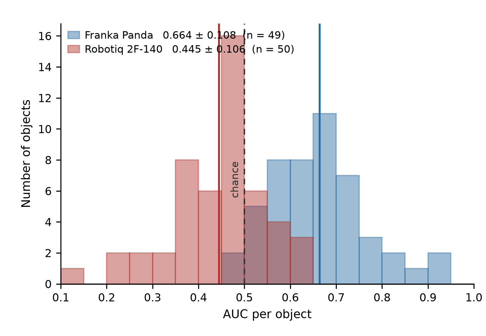

# Step 3 — Where to grasp?

Given the object and the gripper chosen in Step 2, produce a grasp pose.

**Model: GraspGenX** (NVIDIA), used frozen. It runs on this Mac at 1–3 s per object.

## What goes in and out

| | |
|---|---|
| **object** | a point cloud, 2048 points, centred on itself. From a mesh, or from depth plus a mask. |
| **gripper** | **12 numbers**: the box the fingers sweep through when open and half-closed. Nothing else — no mesh, no finger count. |
| **out** | 20–200 grasp poses, each with a confidence score |

**Our grippers need 12 measured numbers each — no CAD, no URDF.** We checked: the same gripper
loaded from its asset files and rebuilt from 12 numbers gives identical scores.

## Result 1 — the released score is unreliable across grippers

We scored GraspGen's labelled grasps with GraspGenX's own discriminator and compared against the
ground truth. 50 objects per gripper, 200 grasps each.

| gripper | AUC |
|---|---|
| Franka Panda (80 mm) | **0.664** |
| Robotiq 2F-140 (140 mm) | **0.445** |

**AUC** is the chance the score ranks a successful grasp above a failed one. 0.5 is a coin flip, so
**0.445 is worse than random** — for that gripper the score is anti-correlated with success.

It is not a coordinate mix-up: a search over grasp roll and standoff peaks at only 0.515, while the
Franka's equivalent sweep has a clean peak, which is what a correct convention looks like.

**So the score cannot be compared between grippers.** That is why the pipeline picks the gripper
first and uses the score only to rank poses within it.



*Per-object AUC for both grippers. The Robotiq distribution sits left of the chance line — its score
is anti-correlated with success.*

## Result 2 — a small scorer recovers the gripper it fails on

If the score is unreliable on our fin-ray, we need a fallback. So we trained our own on the same
labels: **89,512 grasps over 226 objects**, each described by 18 geometric numbers — where the grasp
sits, which way it approaches, what the surface looks like there, how much object is between the
jaws. Objects held out, not just grasps.

| gripper | GraspGenX | ours | |
|---|---|---|---|
| Franka Panda | **0.664** | 0.607 | −0.057 |
| Robotiq 2F-140 | 0.445 | **0.587** | **+0.142** |

**Where GraspGenX works it stays ahead** — it is a far larger model trained on 53M grasps against our
90K. **Where it fails, our scorer recovers usable signal**, moving from below chance to clearly above
it. No new data collection needed.

**What carries the signal** (AUC lost when a feature group is removed):

| feature | contribution |
|---|---|
| local surface shape at the contact | **+0.048** |
| approach direction | +0.019 |
| position on the object | +0.004 |
| object between the jaws | −0.003 |

Almost all of it is **the shape of the surface where the fingers land**. A grasp scorer needs local
geometry at the contact, not a global description of the object.


*Left: ours recovers the gripper GraspGenX fails on. Middle: local surface shape carries almost all
the signal. Right: it works on most held-out objects, but not all.*

## Files

| file | what it does |
|---|---|
| `discriminator_auc.py` | scores dataset grasps with GraspGenX, AUC against ground truth |
| `plot_auc_results.py` | the GraspGenX figure |
| `01_build_grasp_dataset.py` | 18 geometric features per grasp |
| `02_train_scorer.py` | trains our scorer, compares, runs the ablations |
| `03_plot_scorer.py` | the comparison figure |
| `GraspGenX/` | the upstream repo, installed with `pip -e` |

```bash
conda activate graspgenx
GRASPGENX_DEVICE=cpu python step3_grasp_graspgenx/discriminator_auc.py \
    --gripper franka_panda --shard 6 --n_objects 50 --only_shared \
    --out step3_grasp_graspgenx/results/auc_franka.json
python step3_grasp_graspgenx/01_build_grasp_dataset.py
python step3_grasp_graspgenx/02_train_scorer.py
python step3_grasp_graspgenx/03_plot_scorer.py
```

**`GRASPGENX_DEVICE=cpu` is required.** MPS does not error — it returns wrong numbers.

## Rebuilding GraspGenX

Not tracked in git; it is NVLabs' repo with its own history.

```bash
git clone https://github.com/NVlabs/GraspGenX.git step3_grasp_graspgenx/GraspGenX
cd step3_grasp_graspgenx/GraspGenX
git apply ../setup/graspgenx-mac-device.patch
python -m pip install -e .
```

## What is needed to finish

Fill in the 12 swept-volume numbers for both our configurations, then measure the score's AUC on our
own gripper. If it comes back near chance, switch to the scorer above.
